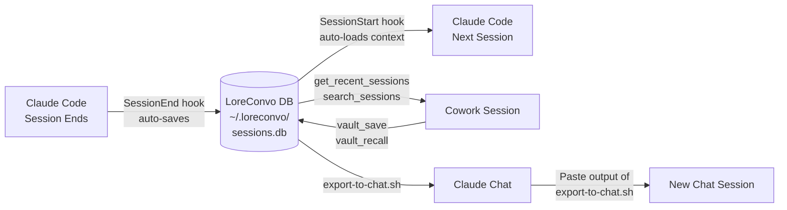

# LoreConvo

> Cross-surface persistent memory for Claude sessions. Vault your conversations from Code, Cowork, and Chat -- recall decisions, artifacts, and context in any future session. Never re-explain yourself again.

**By [Labyrinth Analytics Consulting](https://labyrinthanalyticsconsulting.com)**

---

## Quick Install

**Requires [uv](https://docs.astral.sh/uv/getting-started/installation/) -- a fast Python package manager.**

```bash
# Install uv (one time, if you don't have it)
curl -LsSf https://astral.sh/uv/install.sh | sh
```

### Option A: Install from the Labyrinth Analytics marketplace

```bash
# 1. Add the marketplace (one time)
/plugin marketplace add labyrinth-analytics/claude-plugins

# 2. Install the plugin
/plugin install loreconvo@labyrinth-analytics-claude-plugins

# 3. Enable the MCP server
/install loreconvo
```

### Option B: Add directly as an MCP server

Add to your Claude Code settings (`.claude/settings.json`):

```json
{
  "mcpServers": {
    "loreconvo": {
      "command": "uvx",
      "args": ["loreconvo"]
    }
  }
}
```

---

## Post-Install Setup

After installing, complete these steps to get the most out of LoreConvo:

### 1. Add CLAUDE.md instructions

Add the following to your project's `CLAUDE.md` or global `~/.claude/CLAUDE.md`:

```markdown
## LoreConvo Session Memory

At the start of every session, call `get_recent_sessions` to load context from prior sessions.
At the end of every session, call `save_session` to preserve decisions, artifacts, and open questions.
```

This tells Claude to automatically save and load session context.

### 2. Mount the data directory (Cowork only)

If you use **Cowork**, mount your LoreConvo data directory so Cowork sessions can access the database:

- Mount `~/.loreconvo` as a folder in your Cowork project

Without this step, Cowork sessions cannot read or write to your session vault.

---

## The Problem

Claude users who work across Code, Cowork, and Chat lose all context every time they switch tools or start a new session. You end up re-explaining your project architecture, re-describing your tech stack, re-litigating decisions you made two weeks ago.

LoreConvo fixes this.

---

## How It Works Across Surfaces



**Claude Code (fully automatic):** A SessionEnd hook saves your session when you close it. A SessionStart hook loads relevant context when you open a new one. A PreCompact hook automatically saves your session before context compression -- no context lost, even in long sessions. Zero clicks required.

**Cowork:** Use MCP tools directly -- ask Claude to recall what you discussed last time, search for a past decision, or save the current session to the vault.

**Chat (web):** No plugin support, but the included `export-to-chat.sh` script exports a session summary you can paste into a new Chat conversation to bridge context.

---

## What Gets Saved

Each session record captures:

- **Decisions** -- Key choices made during the session
- **Artifacts** -- Files created or modified
- **Open questions** -- Things left unresolved for next time
- **Narrative summary** -- A 2-3 paragraph overview of what happened
- **Tags and persona** -- For filtering and agent-specific memory

---

## MCP Tools Reference

| Tool | What it does |
|---|---|
| `save_session` | Save the current session with decisions, artifacts, and questions |
| `get_recent_sessions` | List sessions from the last N days |
| `get_session` | Get full detail for a specific session |
| `search_sessions` | Full-text search across all session summaries |
| `get_context_for` | Return relevant fragments for a given topic |
| `tag_session` | Tag a session with a persona for filtered recall |
| `link_sessions` | Connect two related sessions with a relationship type |
| `get_project` | Get project details and recent session stats |
| `list_projects` | List all defined projects with session counts |
| `create_project` | Create or update a project definition |
| `get_skill_history` | See all sessions that used a specific skill |
| `vault_suggest` | Proactive suggestions -- what to revisit based on open questions |
| `get_tier` | Check your current tier and license key status |
| `vault_set_tier` | Activate a Pro license key to unlock unlimited sessions |

---

## Supported Platforms

| Platform | Support | Notes |
|---|---|---|
| **Claude Code** | Full | SessionEnd/SessionStart hooks run automatically |
| **Cowork** | Full | MCP tools available; vault_save and vault_recall work end-to-end |
| **Chat (web)** | Partial | No plugin support; use `export-to-chat.sh` to bridge context |

---

## Free vs Pro

| Feature | Free | Pro ($8/mo) |
|---|---|---|
| Sessions stored | Last 50 | Unlimited |
| Search history | 7 days | All time |
| Personas | 1 | Unlimited |
| Projects | 3 | Unlimited |
| Export formats | Markdown | Markdown + JSON |

**[Upgrade to Pro ($8/mo)](https://buy.stripe.com/9B65kv1VOgk3ekr7VD7N600)**

---

## Companion Product

**[LoreDocs](https://github.com/labyrinth-analytics/loredocs)** -- Searchable, structured knowledge base for your AI projects. Where LoreConvo remembers *conversations*, LoreDocs stores *documents* -- specs, configs, guides, and reference material. They work well together.

---

## Data and Privacy

LoreConvo is **local-first**. All data lives in `~/.loreconvo/sessions.db` on your machine. Nothing is sent to any external server. You own your data.

---

## Issues and Feedback

[github.com/labyrinth-analytics/loreconvo/issues](https://github.com/labyrinth-analytics/loreconvo/issues)
